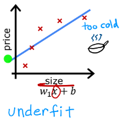
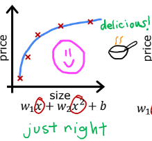
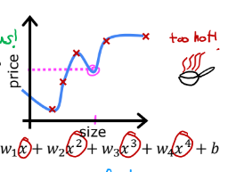
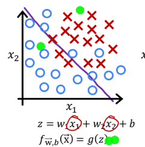
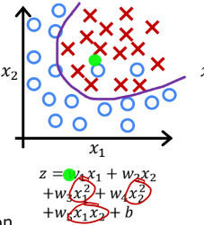
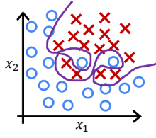
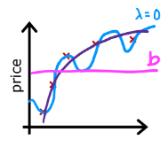
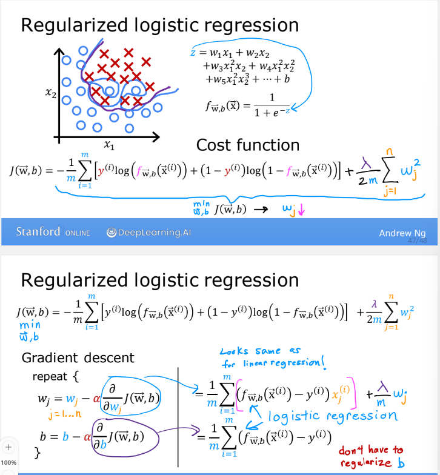

## The Problem of Overfitting

### Regression example

* _underfit_ -> 특징이 너무 적음
* Does not fit the training set well
* 과소적합(high bias)
> bias: 훈련 세트에 정확하게 맞추지 않음. 강한 선입견

* __just right__ ->딱 알맞음
* Fits training set pretty well
* 일반화(generalization)

* _overfit_ -> 특징이 너무 많음
* Fits the training set extremely well
* 과적합(high variance)

### Classification

* $g$ is the sigmoid function
* __underfit, high bias__
* 일차함수 형태 -> 일부 x 표시가 결정 경계선 밖에 있음

* __Just right__
* 원하는 결과에 근접함

* __overfit__
* 결정 경계가 너무 복잡함. 예측 결과가 틀릴 수 있음

---

## Addressing Overfitting

### Collect more training examples

### Select feautures to include/exclude

### Regularization(정규화)

### Addressing Overfitting

Options

1. Collect more data
2. Select features
    * Feature selection
3. Reduce size of parameter
    * "Regulariztion"

[실습1. Lab3-8_Overfitting](week5_1_Overfitting.ipynb)

## Cost Function with Regularization

### Intuition

make $w_3, w_4$ really small(~=0)

$min_{w, b}\frac{1}{2m}\sum_{i=1}^{m}(f_{\overrightarrow{w}, b}(\overrightarrow{x}^{(i)}-y^{(i)})^2$

$+1000w^2_3+1000w^2_4$

### Regularization

small values $w_1, w_2, ..., w_n, b$

simpler model less likely to overfit($w_3~=0, w_4~=0$)

size(x1)|bedrooms(x2)|floors(x3)|age(x4)|avg income(x5)|...|distance to coffee shop(x100)|price(y)
---|---|---|---|---|---|---|---

$w_1, w_2, ..., w_100, b$

$J(\overrightarrow{w}, b)=\frac{1}{2m}\sum_{i=1}^{m}(f_{\overrightarrow{w}, b}(\overrightarrow{x}^{(i)})-y^{(i)})^2 + \frac{\lambda}{2m}\sum_{j=1}^{n}\omega^2_j + \frac{\lambda}{2m}b^2$

$min_{\overrightarrow{w}, b}J(\overrightarrow{w}, b)=min_{\overrightarrow{w}, b}[\frac{1}{2m}\sum_{i=1}^{m}(f_{\overrightarrow{w}, b}(\overrightarrow{x}^{(i)})-y^{(i)})^2 + \frac{\lambda}{2m}\sum_{j=1}^{n}\omega^2_j]$

>$\lambda$ balances both goals

$f_{\overrightarrow{w}, b}(\overrightarrow{x})=w_1x(=0)+w_2x^2(=0)+w_3x^3(=0)+w_4x^4(=0)+b$

$f(x)=b$

> choose $\lambda$

## Regularized Linear Regression

### Regularized linear regression
$min_{\overrightarrow{w}, b}J(\overrightarrow{w}, b)=min_{\overrightarrow{w}, b}[\frac{1}{2m}\sum_{i=1}^{m}(f_{\overrightarrow{w}, b}(\overrightarrow{x}^{(i)})-y^{(i)})^2 + \frac{\lambda}{2m}\sum_{j=1}^{n}\omega^2_j]$

#### Gradient descent

repeat{

$w_j=w_j-\alpha\frac{\partial}{\partial w_j}J(\overrightarrow{w}, b)$
    
$b=b-\alpha\frac{\partial}{\partial b_j}J(\overrightarrow{w}, b)$

}simultaneous update

->

$\frac{1}{m}(f_{\overrightarrow{x}, b}(\overrightarrow{x}^{(i)})-y^{(i)})x_j^{(i)}+\frac{\lambda}{m}\omega _j$

$\frac{1}{m}(f_{\overrightarrow{x}, b}(\overrightarrow{x}^{(i)})-y^{(i)})$
>don't have to regularize b

### Implementing gradient descent

repeat{

$w_j=w_j-\alpha[\frac{1}{m}\sum_{i=1}^{m}[f_{\overrightarrow{w}, b}(\overrightarrow{x}^{(i)})-y^{(i)})x^{(i)}_j]+\frac{\lambda}{m}w_j]$
    
$b=b-\alpha\frac{1}{m}\sum_{i=1}^{m}(f_{\overrightarrow{w}, b}(\overrightarrow{x}^{(i)})-y^{(i)})$

}simultaneous update($j=1...n$)

$w_j1w_j-\alpha\frac{\lambda}{m}w_j-\alpha\frac{1}{m}(f_{w, b}(\overrightarrow{x}^{(i)}-y^{(i)})x_j^{(i)}$
>usual update

$w_j=(1-\alpha\frac{\lambda}{m})$
> shrink $w_j$

$\alpha\frac{\lambda}{m}=0.01\frac{1}{50}=0.0002$

$w_j\frac{(1-0.0002)}{0.9998}$

### How we get the derivative term (optional)

## Regularized Logistic Regression

[실습2. Lab3-9 Regularization](week5_2_Regularization.ipynb)

