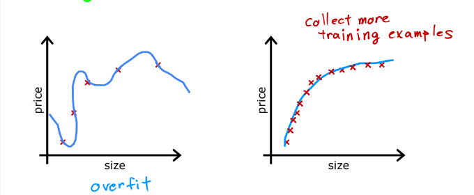
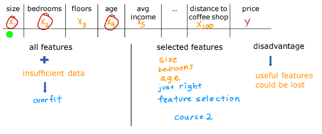
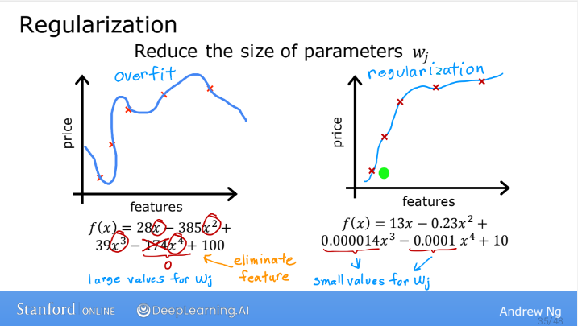
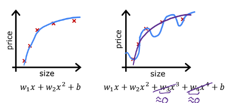
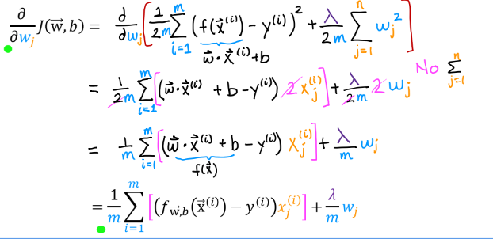

# The Problem of Overfitting
우리가 이전에 예시로 들었던 집값 예측 문제를 다시 살펴보자. 선형회귀로 집의 크기로부터 집값을 예측하는 문제였고, 선형 함수를 데이터에 맞게끔 적용하여 예측을 할 수 있었다. 하지만 아래 왼쪽 그래프처럼 이 모델은 그리 좋은 모델이 아니다. 데이터를 확인해보면 집값이 커질수록 집값이 완만하게 증가하지만, 선형 함수는 집값이 커질수록 동일하게 집값이 증가하는 것을 볼 수 있다.

왼쪽 그래프와 같은 문제를 Underfitting(과소적합)이라고 하며, 다른 말로는 해당 모델(알고리즘)이 high bias(높은 편향)을 가지고 있다고 한다.
가운데 그래프처럼 2차함수를 적용하여 표현할 수 있으며, 데이터와 꽤 잘 맞는 모델을 얻을 수 있다.(Just Right)
오른쪽 그래프와 같이 조금 극단적인 예제를 보면 4차함수에 데이터를 맞추고 있고, 적어도 훈련용 데이터에 한해서는 정확한 값을 예측할 수 있지만, 우리는 이 그래프를 보고 제대로 된 집값을 예측할 것이라고는 생각되지 않을 것이다.
이처럼 이렇게 훈련 세트에 너무 맞춘 문제를 Overfitting(과적합)이라고 한다. 다른 말로는 high variance(높은 분산)을 가지고 있다고 한다.
리를 하자면 과적합 문제는 많은 feature(특성)들이 존재할 때, 우리의 Hypothesis Function(가설 함수)가 복잡해지고 Training Set에 대해서만 잘 맞아서 다른 새로운 Data가 들어왔을 때, 그 값에 대한 일반화된(generalized) 예측을 제대로 하지 못하는 경우는 말한다. 여기서 Generalized는 새로운 Data에 대해서 얼마나 잘 맞는가 라는 의미이다.
이 문제는 Logistic Regression에도 마찬가지로 발생한다.

위처럼 $x_1, x_2$에 대한 선형 회귀의 예제가 있다. 우리는 왼쪽 그래프처럼 간단한 가설함수를 사용하면서 선형 함수로 positive와 negative를 나눌 수 있지만, 데이터와 잘 맞아 떨어지지는 않는다. 이런 경우 아까 위에서 설명한 과소 적합 케이스다.
가운데 그래프처럼 좀 더 나아가서 높은 차원의 특성을 추가하여 가설 함수를 사용하면 꽤 잘 맞는 Decision Boundary를 얻을 수 있고, 데이터에도 적절하게 맞아떨어지는 것을 볼 수 있다.
그리고 오른쪽 그래프처럼 극단적으로 엄청나게 많은 고차항을 특성으로 추가하여 엄청 높은 차수의 다항식을 만들면 해당 로지스틱 회귀는 데이터에 정말 잘 맞는 결정 경계선을 얻을 수 있다. 이런 경우 아까 언급한 과적합 케이스다. 이 가설은 정말 좋지 못한 예측을 하는 것이고, 새로운 예제에 일반화(Generalization)되지 않는다.

---

# Addressing Overfitting

### Collect more training examples

### Select feautures to include/exclude

집값을 예측하는데, 특성(feature)가 엄청나게 많은 경우이다. 그리고 특성 하나하나가 집값 예측에 도움이 될 것 같은 경우이다. 이렇게 특성이 많은데, Training Set(학습 데이터)가 적은 경우에 과적합 문제가 발생할 수 있다.

1. Reduce number of features.
특성의 개수를 줄이는 것이다. 구체적으로는 특성들을 살펴보면서 어떤 특성은 남겨두고, 어떤 특성은 제거하는 식으로 특성을 선택할 수 있다. 추후에 Model selection algorithm에 대해서 배울 것이고, 이 알고리즘은 어떤 특성을 사용할 건지 자동으로 선택하거나 제거하는 알고리즘이다.
이렇게 특성을 줄이는 것으로 과적합 문제를 해결할 수 있다.

### Regularization(정규화)

2. Regularization 정규화

이 방법은 모든 feature특성을 유지하지만, 각 특성들이 갖는 영향을 줄이는 것이다. 다시 말하자면, parameter w, b가 미치는 영향을 줄이는 것이다. 값을 예측하기 위한 수많은 feature들이 존재하고, 각 feature들이 예측에 작은 영향을 미치는 경우에 잘 동작한다.

### Addressing Overfitting
Options

1. Collect more data
2. Select features
    * Feature selection
3. Reduce size of parameter
    * "Regulariztion"

[실습1. Lab3-8_Overfitting](week5_1_Overfitting.ipynb)

---

## Cost Function with Regularization

### Intuition

위와 같은 선형 회귀에서 왼쪽 그래프의 경우에는 데이터에 잘 맞는 경우이고, 오른쪽의 경우에는 과적합 현상이 발생한 경우이다. 그래서 우리는 오른쪽의 경우에 $w_3, w_4$를 최소화하려고 하고, 이 값이 0에 근접한다면 가설 함수는 2차 함수에 근접해지고 더욱 간단해진다. 결과적으로 과적합 현상이 줄어들 것이다.

make $w_3, w_4$ really small(~=0)

$$min_{w, b}\frac{1}{2m}\sum_{i=1}^{m}(f_{\overrightarrow{w}, b}(\overrightarrow{x}^{(i)}-y^{(i)})^2+1000w^2_3+1000w^2_4$$

### Regularization

앞서 정규화는 매개변수 $w_1, w_2, ..., w_n, b$이 작은 값을 가져서 작은 영향을 미치게 하는 것이라고 하였다.
이렇게 정규화를 통해 작은 매개변수 값을 가지게 된다면, 가설 함수는 더욱 간단해질 것이고, 과적합 가능성이 줄어들 것이다. 이제 우리는 각 매개변수에 가중치(Penalty)를 부여하기 위해서 기존의 비용 함수에 가중치를 더해서 아래와 같이 사용할 것이다.(집값 문제 예제를 통해 적용했다.)

small values $w_1, w_2, ..., w_n, b$

simpler model less likely to overfit($w_3~=0, w_4~=0$)

size(x1)|bedrooms(x2)|floors(x3)|age(x4)|avg income(x5)|...|distance to coffee shop(x100)|price(y)
---|---|---|---|---|---|---|---

$w_1, w_2, ..., w_100, b$

$$J(\overrightarrow{w}, b)=\frac{1}{2m}\sum_{i=1}^{m}(f_{\overrightarrow{w}, b}(\overrightarrow{x}^{(i)})-y^{(i)})^2 + \frac{\lambda}{2m}\sum_{j=1}^{n}\omega^2_j + \frac{\lambda}{2m}b^2$$

$min_{\overrightarrow{w}, b}J(\overrightarrow{w}, b)=min_{\overrightarrow{w}, b}[\frac{1}{2m}\sum_{i=1}^{m}(f_{\overrightarrow{w}, b}(\overrightarrow{x}^{(i)})-y^{(i)})^2 + \frac{\lambda}{2m}\sum_{j=1}^{n}\omega^2_j]$

식의 오른쪽 가중치의 합이 1부터 시작하는 것은 b=1로 고정되어 있어서 줄여줄 필요가 없기 때문이다. 여기서 $\lambda$는 정규화 매개변수로 가설함수를 더욱 간단하게 만들어서 과적합을 줄여준다.

정규화를 하지 않은 파란색 그래프는 많이 복잡하게 그려지고 새로운 데이터에 대한 예측이 제대로 이루어지지 않을 것이다. 하지만, 정규화를 하여 더욱 간단해진 분홍색 그래프는 기존 그래프보다 훨씬 더 좋은 가설함수라고 볼 수 있다.

$f_{\overrightarrow{w}, b}(\overrightarrow{x})=w_1x(=0)+w_2x^2(=0)+w_3x^3(=0)+w_4x^4(=0)+b$

$f(x)=b$

> choose $\lambda$

---

# Regularized Linear Regression

선형 회귀에서의 최적의 매개변수 w, b를 찾는 방법은 경사 하강법이 있다.
### Regularized linear regression
$$min_{\overrightarrow{w}, b}J(\overrightarrow{w}, b)=min_{\overrightarrow{w}, b}[\frac{1}{2m}\sum_{i=1}^{m}(f_{\overrightarrow{w}, b}(\overrightarrow{x}^{(i)})-y^{(i)})^2 + \frac{\lambda}{2m}\sum_{j=1}^{n}\omega^2_j]$$

#### Gradient descent

repeat{

$w_j=w_j-\alpha\frac{\partial}{\partial w_j}J(\overrightarrow{w}, b)$
    
$b=b-\alpha\frac{\partial}{\partial b_j}J(\overrightarrow{w}, b)$

}simultaneous update

->

$\frac{1}{m}(f_{\overrightarrow{x}, b}(\overrightarrow{x}^{(i)})-y^{(i)})x_j^{(i)}+\frac{\lambda}{m}\omega _j$

$\frac{1}{m}(f_{\overrightarrow{x}, b}(\overrightarrow{x}^{(i)})-y^{(i)})$
>don't have to regularize b

### Implementing gradient descent
선형 회귀에서의 경사하강법은 기존에 배웠던 것과 유사하게 아래 알고리즘을 사용하면 된다.

repeat{

$w_j=w_j-\alpha[\frac{1}{m}\sum_{i=1}^{m}[f_{\overrightarrow{w}, b}(\overrightarrow{x}^{(i)})-y^{(i)})x^{(i)}_j]+\frac{\lambda}{m}w_j]$
    
$b=b-\alpha\frac{1}{m}\sum_{i=1}^{m}(f_{\overrightarrow{w}, b}(\overrightarrow{x}^{(i)})-y^{(i)})$

}simultaneous update($j=1...n$)

$w_j=1w_j-\alpha\frac{\lambda}{m}w_j-\alpha\frac{1}{m}(f_{w, b}(\overrightarrow{x}^{(i)}-y^{(i)})x_j^{(i)}$
>usual update

$=w_j(1-\alpha\frac{\lambda}{m})$
> shrink $w_j$

$\alpha\frac{\lambda}{m}=0.01\frac{1}{50}=0.0002$

$w_j\frac{(1-0.0002)}{0.9998}$

### How we get the derivative term (optional)

# Regularized Logistic Regression

로지스틱 회귀에서의 비용 함수는 위와 같다. 우리는 이제 정규화를 한 비용함수를 고려할 것이고, 일반화된 로지스틱 회귀의 비용함수는 다음과 같다.

$$J(\vec{w}, b)=-\frac{1}{m}\sum_{i=1}{m}[y^{(i)}log(f_{\vec{w}, b}(\vec{x}^{(i)}))+(1-y^{(i)})log(1-f_{\vec{w}, b}(\vec{x}^{(i)}))]$$

#### Gradient descent
반복{
$$w_j=w_j-\alpha\frac{\partial}{\partial w_j}, (\frac{\partial}{\partial w_j}=\frac{1}{m}\sum_{i=1}^{m}(f_{\vec{w}, b}(\vec{x}^{(i)})-y^{(i)})x_j^{(i)}+\frac{\lambda}{m}w_j))$$
$$b=b-\alpha\frac{\partial}{\partial b}, (\frac{\partial}{\partial w_j}=\frac{1}{m}\sum_{i=1}^{m}(f_{\vec{w}, b}(\vec{x}^{(i)})-y^{(i)})))$$
}계속 업데이트

경사 하강법의 일반 식은 선형 회귀와 동일하다. 하지만, 가설함수 $f_{\vec{w}, b}(x)$가 다르다.
