# Neurons and the brain

## Neural networks
* Origins: Algorithms that try to mimic the brain(1950's)

* Used in the 1980's and early 1990's. Fell out of favor in the late 1990's

* Resurgence from around 2005.

* speech -> images(2012, ImageNet) -> text(자연어처리)(NLP)

---

## Neurons in the brain
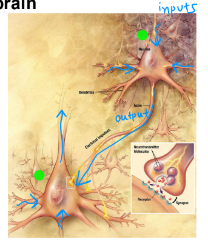

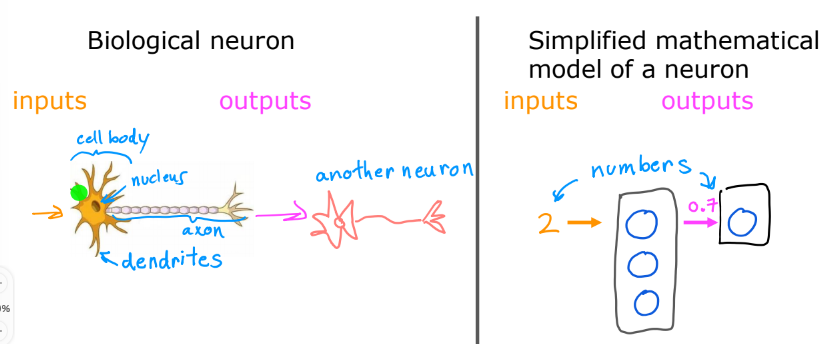

> dendrites: 수상돌기
> axon: 축석돌기

> 인공 뉴런 모델
> 여러 개의 뉴런 모델이 여러개의 입력을 받고, 숫자를 출력함

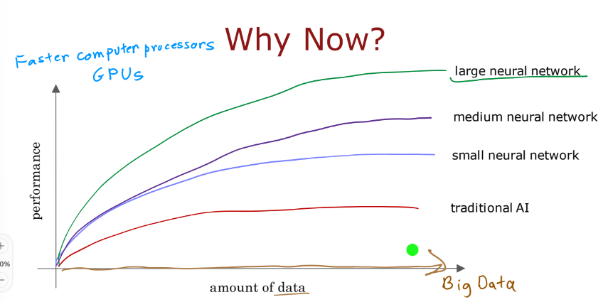
* 가로축: 데이터 양(Big Data 이용), 세로축: 학습 알고리즘의 정확성(컴퓨터 프로세서나 GPU가 성능을 좌우함)
* 기존 전통적 알고리즘은 아무리 많은 데이터가 있어도 정확성에 한계가 있다.
* 신경망이 커질수록(뉴런 수 증가) 성능이 계속 증가한다.

---

## Demand Prediction(수요 예측)
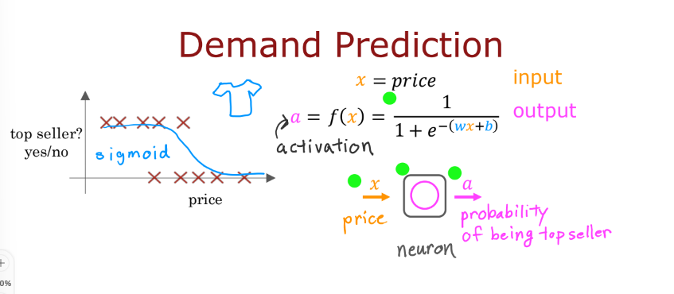
* 기존 로지스틱 회귀를 사용하여 수요 예측
* $x=$price, $a=f(x)=\frac{1}{1+e^{-(wx+b)}}$

> $a$: 출력, top seller가 될 확률, $x$: 입력, 가격

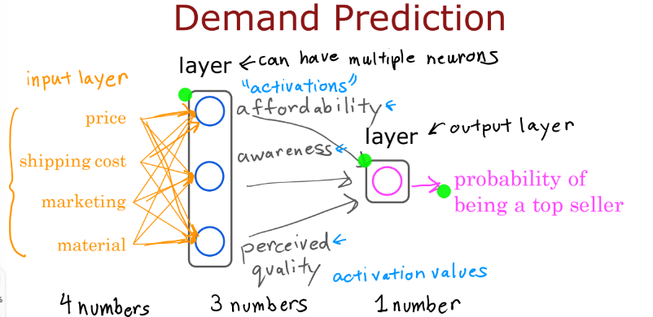
* 가격, 배송비 -> 경제성 |
* 마케팅 -> 인지도       | -> Top Seller가 될 확률
* 재료값 -> 품질         |

 (입력값)  (인공 뉴런)        (출력값)

 (4개)      (3개)             (1개)
  
            (층): 여러개의 뉴런을 갖고 있음.
            (출력 층): 마지막 뉴런
경제성, 인지도, 품질: 활성화 값. 생물학적 뉴런을 출력을 내보낼 때 연결되어있는 다른 뉴런을 활성화 시킬 때 사용됨
* 4개의 숫자가 입력되면 이 신경망 계층에서는 3개의 숫자가 계산되어 나오고, 3개의 숫자값이 출력층에 들어가서 하나의 값을 출력함.

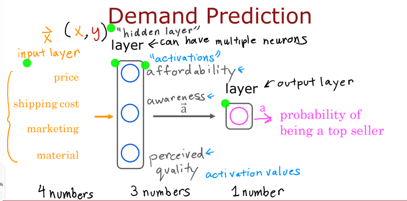

* 입력값: $\overrightarrow{x}$, 은닉층(hidden layer)(경제성, 인지도, 품질) -> $\overrightarrow{a}$, 출력층(output layer) $a$
* 4개의 입력 -> 3개의 출력, 3개의 입력 -> 1개의 출력(최종 결과)
> 잠재적으로 사용하고자 하는 특징들의 종류가 계산을 통해서 스스로 파악됨 -> 신경망이 강력한 알고리즘이라는 설명
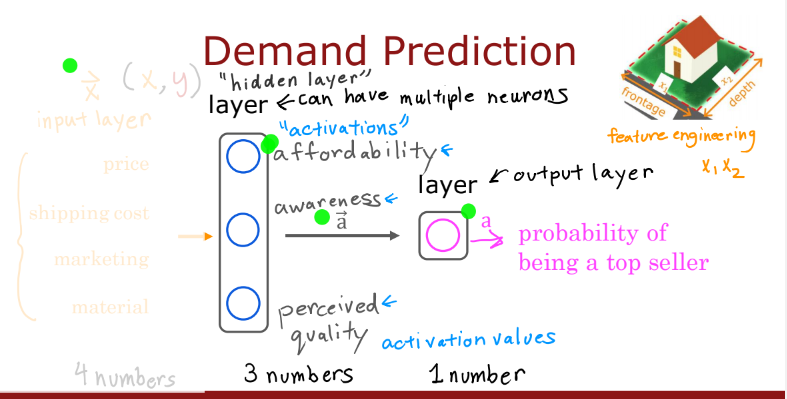

* 출력 층은 로지스틱 회귀를 풀고 있다. -> Top Seller가 될 확률 $a$를 출력.

* 좀 더 복잡한 특징 $x_1, x_2$를 계산할 특징(feature engineering) -> 수동적으로 계산

* 인공신경망의 특징: 자동적으로 학습을 통해 판단

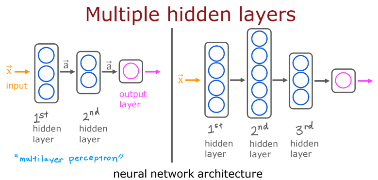
* $\mathbf{x}$가 입력되면 3개의 뉴런이 있는 첫 번째 은닉층에 들어가면 출력으로 $\mathbf{a}$가 나오고, $\mathbf{a}$가 2개의 뉴런이 있는 두 번째 은닉층에 들어가면 두번째 출력, 그리고 출력층에 들어가서 최종 결과 $a$ 출력.
> **Multilayer Perceptron (MLP)** 

---

## Example: Recognizing Images
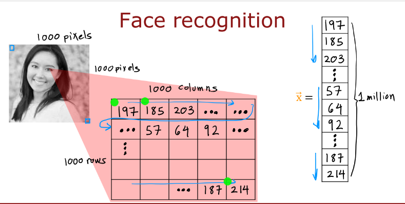
* 이미지 크기: 1000(px) $\times$ 1000(px)
* 밝기값: 0~255
* 각각의 행을 하나의 벡터로 만들기: $\mathbf{x}=\{197, 185, 203, ..., 187, 214\}$

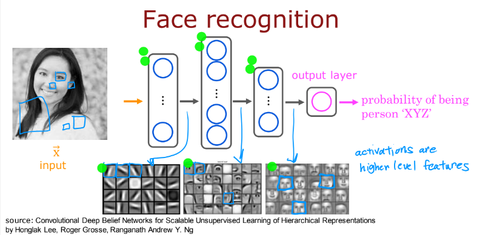
* 방금 전 벡터를 입력
* 첫번째 은닉층의 결과: 해당 방향의 직선을 찾음
* 두번째 은닉층의 결과: 얼굴의 일부를 찾아냄. 눈이 있는지, 코가 있는지, 귀의 모양은 어떤지...
* 세번째 은닉층의 결과: 얼굴 모양을 찾아냄
* 출력층: 해당 인물이 일치할 확률을 출력함.
  
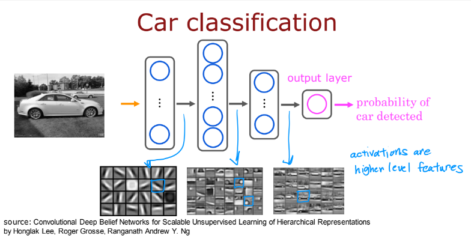
* 자동차 예시

---

## Neural network layer

* Layer0: 입력값 $\mathbf{x}=[197, 184, 136, 214]$를 세 개의 뉴런에 입력
* Layer1
   * 첫 번째 은닉층의 매개변수와 출력값: 매개변수: $\mathbf{w}_1, b_1$
   * 출력값: $a=g(\mathbf{w}\cdot\mathbf{x}+b_1}=0.3$
   * 두 번째 은닉층의 매개변수와 출력값: 매개변수: ", 출력값: "$=0.7$
   * 세 번째 은닉층 " : 매개변수: " , 출력값: $a=g(\mathbf{w_3}\cdot z + b_3$=0.2
      * g(z)=\frac{1}{1+e^{-(z)}}
   * 최종 출력값: $\mathbf{a}^{[1]}=[0.3, 0.7, 0.2]$
      * 최종 출력값의 출처 은닉층을 알려주기 위해 출력값의 윗첨자에 $[n]$을 써준다.

* Layer2
   * 입력값: $a^{[1]}$
   * 출력값의 매개변수: $\mathbf{w_1}+b_1$
   * 출력값: $\mathbf{a}_1=g(\mathbf{w}_1\cdot \mathbf{a^{[1]}}+b1)$

* 출력값: $a^{[2]}=0.84$
* 결과: $a^{[2]}가 0.5보다 크거나 같나?$
   * 참: $y=1$, 거짓: $y=0$
